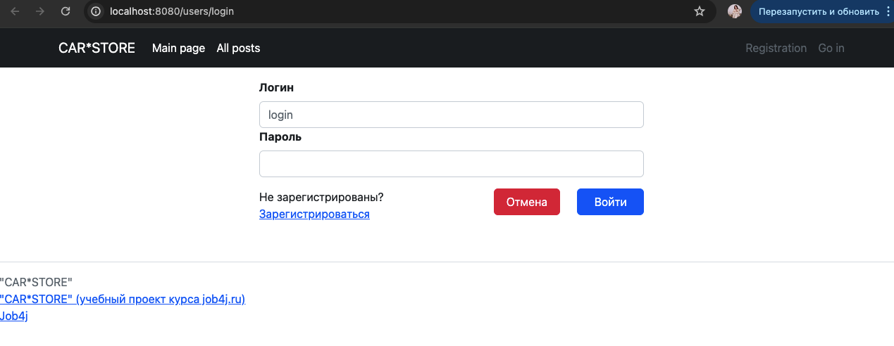
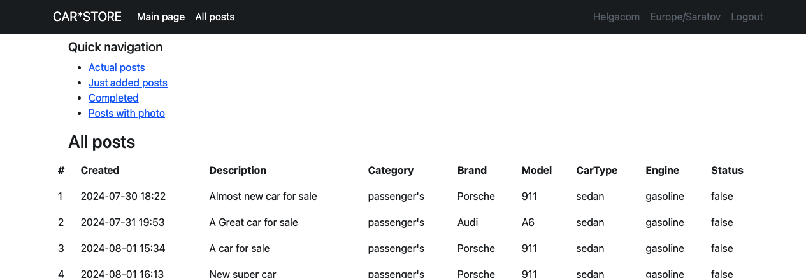
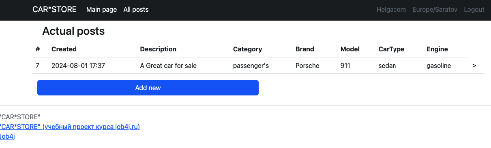
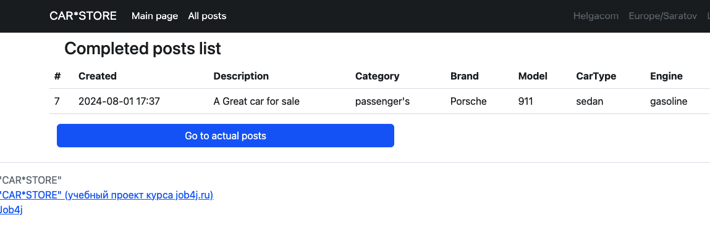
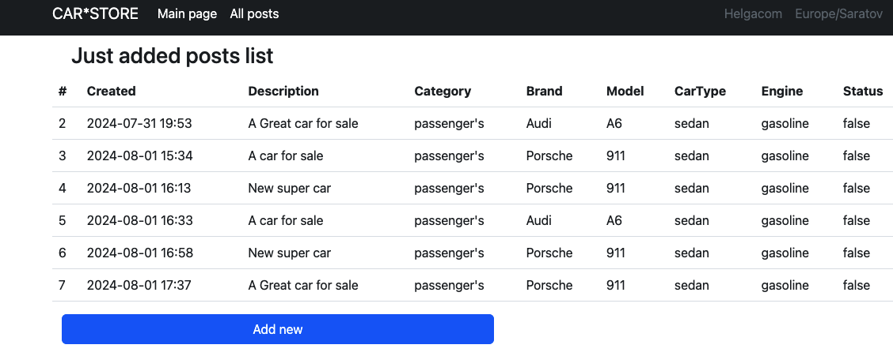
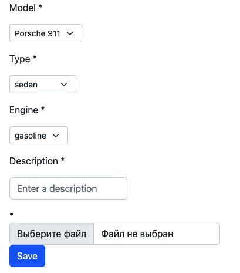

# job4j_cars

## О проекте

Этот проект - web приложение "Cars" - сервис по размещению обьявлений о продаже машин

## Стек технологий

Java 17 & PostgreSQL & Maven & Spring Boot & Liquibase & Thymeleaf & Bootstrap & JUnit & Hibernate

## Требования к окружению

Java 17 & PostgreSQL 14 & Maven 3.8

## Взаимодействие с приложением
### 1. Стартовая страница
Содержит поля для входа/регистрации

### 2. Главная страница
Основная страница со ссылками для быстрой навигацией по объявлениям

### 3. Разделы сервиса

общий список

выборки 

страница создания объявления

## Контакты
https://github.com/Helgacom